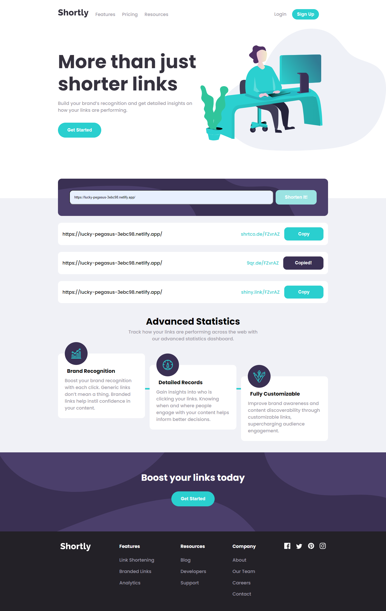

# Shortly URL shortening API

## Table of contents

- [Overview](#overview)
  - [The challenge](#the-challenge)
  - [Screenshot](#screenshot)
  - [Links](#links)
- [My process](#my-process)
  - [Built with](#built-with)
- [Author](#author)

## Overview

### The challenge

Users should be able to:

- View the optimal layout for the site depending on their device's screen size
- Shorten any valid URL
- See a list of their shortened links, even after refreshing the browser
- Copy the shortened link to their clipboard in a single click
- Receive an error message when the `form` is submitted if:
  - The `input` field is empty

### Screenshot

### Links

- Solution URL: [GitHub](https://github.com/wonder-filka/URL-shortening-API-landing-page)
- Live Site URL: [Netlify](https://lucky-pegasus-3ebc98.netlify.app/)

## My process

### Built with

- HTML5
- CSS
- Flexbox
- ES6 - JS
- JQuery - JS Library

## Author

- Website - [Iryna Filonova](https://sensational-cactus-93a152.netlify.app/)
- Linkedin - [Iryna Filonova] (https://www.linkedin.com/in/iryna-filonova-6487a8237/)
